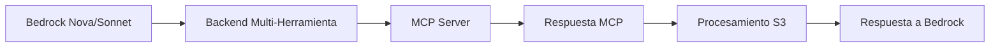

# 🏗️ Arquitectura del Sistema

## 🎯 Visión General

Sistema completo para integrar **Bedrock Function Calling** con **MCP Servers** y **S3 Storage**, permitiendo que Bedrock Nova/Sonnet ejecute herramientas MCP dinámicamente.

## 🔄 Flujo de Datos



## 🧩 Componentes

### 1️⃣ **Bedrock Function Calling**
- **Entrada**: Consultas en lenguaje natural
- **Salida**: tool_use estructurado
- **Formato**: JSON con toolUseId, name, input

### 2️⃣ **Backend Multi-Herramienta** (Puerto 8000)
- **Función**: Traductor universal Bedrock ↔ MCP
- **Características**:
  - Procesa cualquier herramienta MCP dinámicamente
  - Logging detallado y auditoría
  - Manejo de errores robusto
  - Organización por proyectos

### 3️⃣ **MCP Servers**
- **URL Base**: `https://mcp.danielingram.shop`
- **Herramientas**: 30+ herramientas disponibles
- **Tipos**: Diagramas, documentación, templates, etc.

### 4️⃣ **S3 Storage**
- **Bucket**: `controlwebinars2025`
- **Estructura**: `arquitecturas/{proyecto}/{herramienta}/{timestamp}_{uuid}_{archivo}`
- **URLs**: Presignadas con expiración de 1 hora

### 5️⃣ **MCP S3 Wrapper** (Opcional - Puerto 8001)
- **Función**: Intercepta herramientas específicas
- **Objetivo**: Agregar subida automática a S3
- **Estado**: Implementado pero limitado por MCP original

## 📊 Formato de Mensajes

### Entrada (Bedrock → Backend)
```json
{
  "toolUse": {
    "toolUseId": "user-request-123",
    "name": "generate_diagram",
    "input": {
      "code": "código del diagrama",
      "project_name": "mi-proyecto"
    }
  },
  "conversationId": "conversation-123",
  "messageId": "message-123"
}
```

### Salida (Backend → Bedrock)
```json
{
  "toolResult": {
    "toolUseId": "user-request-123",
    "content": [
      {"text": "✅ generate_diagram ejecutado exitosamente"},
      {"text": "📁 Archivo: diagrama.png"},
      {"text": "🔗 URL: https://bucket.s3.amazonaws.com/..."},
      {"text": "📋 Proyecto: mi-proyecto"},
      {"text": "⏱️ Tiempo: 2.18s"}
    ]
  }
}
```

## 🔧 Configuración del Sistema

### Variables de Entorno
```bash
# Backend Principal
AWS_REGION=us-east-1
S3_BUCKET=controlwebinars2025
MCP_BASE_URL=https://mcp.danielingram.shop/bedrock/tool-use
USE_PRESIGNED_URLS=true
PRESIGNED_URL_EXPIRATION=3600
LOG_LEVEL=INFO

# MCP S3 Wrapper (si se usa)
ORIGINAL_MCP_URL=https://mcp.danielingram.shop/bedrock/tool-use
```

### Permisos IAM
```json
{
  "Version": "2012-10-17",
  "Statement": [
    {
      "Effect": "Allow",
      "Action": [
        "s3:PutObject",
        "s3:PutObjectAcl",
        "s3:GeneratePresignedUrl"
      ],
      "Resource": "arn:aws:s3:::controlwebinars2025/arquitecturas/*"
    }
  ]
}
```

## 📈 Métricas y Monitoreo

### Logs Estructurados
- **Request ID único** para cada solicitud
- **Timestamps precisos** para análisis de performance
- **Status de éxito/error** para monitoreo
- **Tiempo de procesamiento** para optimización

### Endpoints de Salud
- `GET /health` - Health check básico
- `GET /` - Información del servicio
- `GET /projects/{name}/files` - Listado de archivos

## 🚀 Escalabilidad

### Horizontal
- **Múltiples instancias** del backend
- **Load balancer** para distribución
- **Auto-scaling** basado en demanda

### Vertical
- **Optimización de memoria** para procesamiento
- **Cache de respuestas** MCP frecuentes
- **Pool de conexiones** HTTP

## 🔐 Seguridad

### Autenticación
- **IAM Roles** para acceso a S3
- **URLs presignadas** para acceso temporal
- **No exposición** de archivos temporales

### Auditoría
- **Logging completo** de todas las operaciones
- **Request IDs** para trazabilidad
- **Timestamps** para análisis temporal

## 🛠️ Mantenimiento

### Logs
- **Ubicación**: `/app/app.log`
- **Rotación**: Automática por tamaño
- **Nivel**: Configurable (DEBUG, INFO, WARNING, ERROR)

### Limpieza
- **Archivos temporales**: Auto-limpieza
- **Logs antiguos**: Rotación automática
- **S3**: Lifecycle policies recomendadas

## 🔮 Futuras Mejoras

1. **Cache Redis** para respuestas MCP frecuentes
2. **WebSocket** para streaming de respuestas largas
3. **Métricas CloudWatch** para monitoreo avanzado
4. **Rate limiting** para protección
5. **Autenticación JWT** para seguridad adicional
